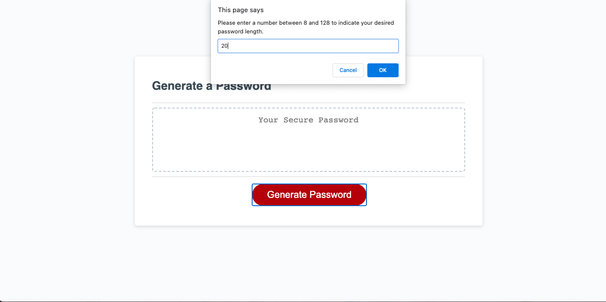
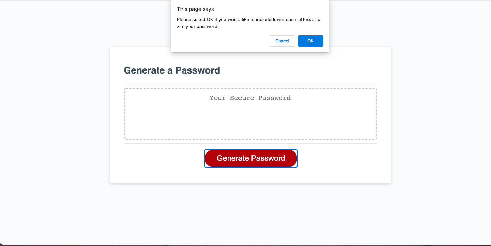
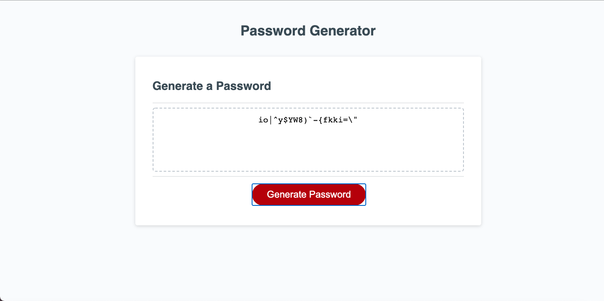

# Stephanie's Password Generator

## Description 

This web application generates a new secure randomly-generated password. The user first chooses a password length >=8 and <= 128 characters. The user is then asked whether to include characters in their password from each of 4 types of character sets: lower case letters a to z, upper case letters A to Z, numbers 0 to 9 and special characters !"#$%&'()*+,-./:;<=>?@[]\^_`{|}~. The user must choose at least one of the character sets, and can include up to all four. The password is then randomly generated from all the characters allowed with the condition that the password must contain at least one character from each of the user-chosen character sets. 

This JavaScript code contains skills I recently learned including utilizing functions, arrays, while loops, and if/else statements, and generating randomized numbers. It also includes code ideas that were found when Googling for answers to questions. These are credited below. 

## Screenshots of web application

## Link

[Link to Stephanie's Password Generator web applicaton](https://sgiel.github.io/generate-password/)

## Credits

[Code for grabbing characters from the Unicode characters and pushing them onto an array](https://gist.github.com/mreigen/fdeafcc08a9e44d976bd6a8db468c496)

[Code for the Fisher-Yates shuffling of an arrayr](https://javascript.info/task/shuffle)

